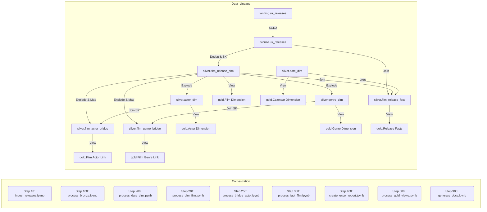

# Live System Architecture

This diagram is **auto-generated** by the ETL pipeline based on the active configuration.

```mermaid
graph LR
    %% Generated Automatically by generate_docs.ipynb
    %% Last Updated: 2025-12-09 08:22

    subgraph Orchestration
        JOB_10("Step 10: ingest_releases.ipynb")
        JOB_100("Step 100: process_bronze.ipynb")
        JOB_200("Step 200: process_date_dim.ipynb")
        JOB_201("Step 201: process_dim_film.ipynb")
        JOB_250("Step 250: process_bridge_actor.ipynb")
        JOB_300("Step 300: process_fact_film.ipynb")
        JOB_400("Step 400: create_excel_report.ipynb")
        JOB_500("Step 500: process_gold_views.ipynb")
        JOB_900("Step 900: generate_docs.ipynb")
    end

    subgraph Data_Lineage
        landing.uk_releases -->|SCD2| bronze.uk_releases
        bronze.uk_releases -->|Dedup & SK| silver.film_release_dim
        bronze.uk_releases -->|Join| silver.film_release_fact
        silver.film_release_dim -->|Join| silver.film_release_fact
        silver.date_dim -->|Join| silver.film_release_fact
        silver.film_release_dim -->|Explode| silver.actor_dim
        silver.film_release_dim -->|Explode| silver.genre_dim
        silver.film_release_dim -->|Explode & Map| silver.film_actor_bridge
        silver.actor_dim -->|Join SK| silver.film_actor_bridge
        silver.film_release_dim -->|Explode & Map| silver.film_genre_bridge
        silver.genre_dim -->|Join SK| silver.film_genre_bridge
        silver.film_release_dim -->|View| gold_Film_Dimension["gold.Film Dimension"]
        silver.date_dim -->|View| gold_Calendar_Dimension["gold.Calendar Dimension"]
        silver.actor_dim -->|View| gold_Actor_Dimension["gold.Actor Dimension"]
        silver.genre_dim -->|View| gold_Genre_Dimension["gold.Genre Dimension"]
        silver.film_actor_bridge -->|View| gold_Film_Actor_Link["gold.Film Actor Link"]
        silver.film_genre_bridge -->|View| gold_Film_Genre_Link["gold.Film Genre Link"]
        silver.film_release_fact -->|View| gold_Release_Facts["gold.Release Facts"]
    end
```